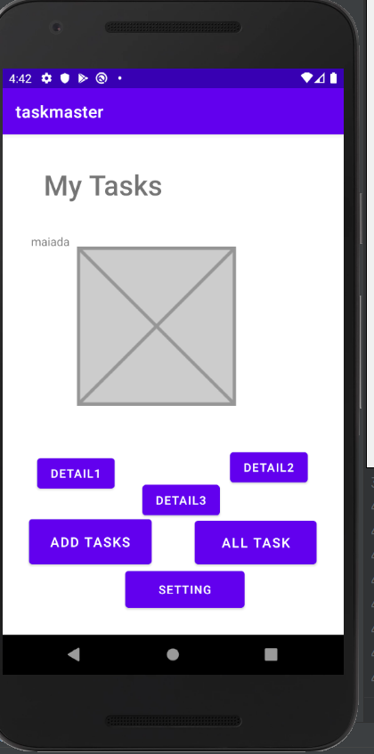

# Lab: 26

in this lab we created a three pages:

- homepage: which include the a photo, and two buttons connected to on click listener that redirect the user to the other pages.
- Add Task page: two text editor (input label); one for insert title and the other one for insert the body conetnts. at this stage the submit button will only show label once press.

- All Tasks page: in this page nothing added till now.

  

<!--  -->

-------------------------------------------------------------------------------
# Lab: 27:
in this lab we created new two pages 
- task details: include a title, and body with Lorem Ipsum content 

- setting page: that accept the user name and render it to the homepage.

-----------------------------------------------------------------------------------------
# Lab: 28 - RecyclerView
In this lab I use a recycler view to show all tasks that the user had and implemented the task class with the appropriate data and displayed each task when clicked on an activity that shows task details.

Main Activity Added the recycler view to the main activity to show all the hard coded tasks and the user can click on them.

--------------------------------------------------------------
# Lab: 29 - Room
in this lab we user the room, which is an ORM (object relational mapper) for SQLite database in Android. to save data (task) at the database, and then invoke all the stored data (tasks) at the all tasks layout.

# Lab: 32 - Amplify and DynamoDB
in this lab, we created cloud storage, on which each time the data saved it, hit the aws server , and store at the database.Also, the at the all list activity will fetch all the data (tasks) form the server and list them using recycle view.

# Lab: 33 - Related Data:
in this lab, we created a new model at the graphql to assign the task to the team. At the biggining we hit the server (database) and save three teams for one time (teamA,B,C). After that we added a spinner at the add task activity to assign the task at one of the three teams.

## Lab: 36 - Cognito:
in this lab we added an authentication system to our android application using of amplify auth. the user can create a user name and verify it using email. For this purpose signUp, Login, logout were created. 

